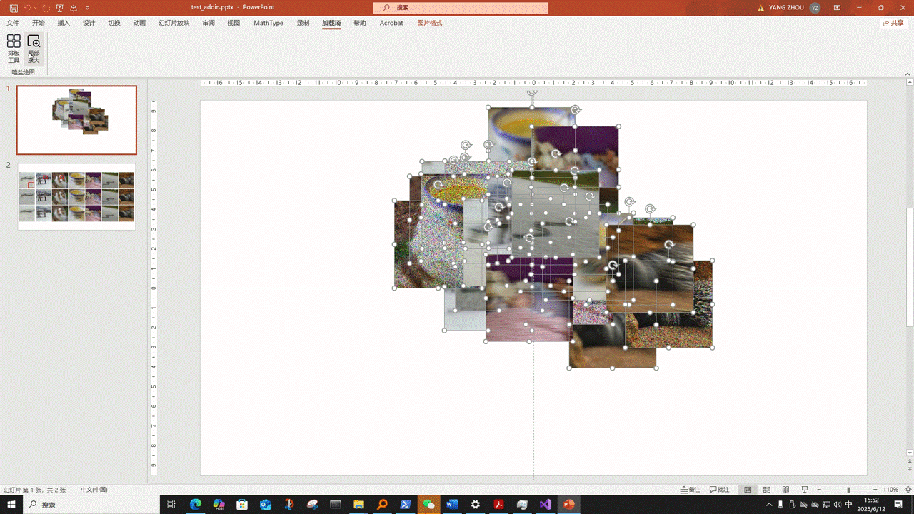
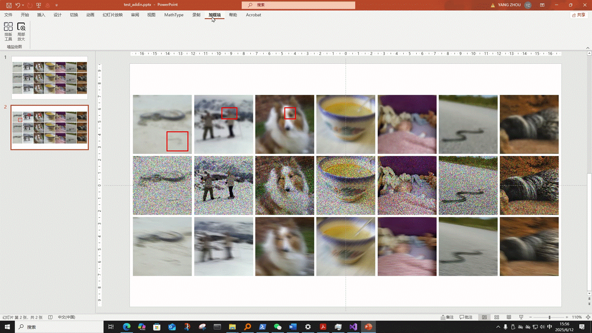

# Low Level Vision PPT Tools（PowerPoint 插件工具：low-level vision方法排版、对比与展示辅助工具）

## 工具简介
A specialized PowerPoint add-in tool designed for low-level vision applications, enabling visual comparison of different methods (algorithms).

本工具是一个适用于low-level视觉任务设计的 PowerPoint 加载项（Add-in），用于快速、便捷地排版、展示和对比不同方法的视觉效果，支持图像排版与局部细节放大，适用于学术演示和实验展示。

---

## 安装指南

1. 点击右侧release，下载其中最新版本的压缩包。
2. 将压缩包解压到你希望保存的位置。
3. 打开解压后的文件夹，找到其中的 `setup.exe` 文件。
4. **双击运行 `setup.exe`** 开始安装。
5. 安装完成后，**重新启动 PowerPoint**。
6. 在 PowerPoint 的顶部工具栏中，点击“加载项”，即可看到 `嗑盐绘图` 插件。

### 如果未能在PPT的工具栏中看到插件：

1. 点击 PowerPoint 左上角“文件”选项卡。
2. 左下角点击“选项”按钮，弹出 PowerPoint 选项窗口。
3. 在左侧底部选择“加载项”。
4. 在窗口底部找到“管理：COM 加载项”，点击右侧的“转到...”按钮。
5. 在弹出的对话框中，**勾选 `pic2ppt`**，点击“确定”。
6. 关闭重启PowerPoint，即可在工具栏的“加载项”中看到插件。

---

## 使用指南

### 先排版，排版使用指南

1. 打开一份 PPT 文件，**新建一个空白页**。
2. 插入你想要展示的图像，**请严格按照以下方式插入图像，否则可能导致排版错乱奥**：注意"examples/text_addin.pptx"中第一张PPT就是方式1插入的图像，第二张是方式2插入的。**插入方式影响步骤4的设置**。

   - **方式 1：** 按照方法1（图像1，图像2，图像3，……），方法2（图像1，图像2，图像3，……），……。的方式插入图像，建议你的文件夹结构为如下所示，这样只要点进各个方法文件夹全选，复制，粘贴到PPT即可。
       - 方法1
         - 图像1
         - 图像2
         - 图像3
         - ……
       - 方法2
         - 图像1
         - 图像2
         - 图像3
         - ……
         -  
   - **方式 2：** 按照图像1（方法1，方法2，方法3），图像2（方法1，方法2，方法3，……），……。的方式插入图像，建议你的文件夹内图像文件的顺序能为如下所示，这样只要全选，复制，粘贴到PPT即可。
     - 方法1跑出来的图像1,方法2跑出来的图像1，方法3跑出来的图像1，……，方法1跑出来的图像2,方法2跑出来的图像2，方法3跑出来的图像2，

3. 插入完成后，全部选中要排版的图，点击工具栏，加载项内的插件中的排版按钮，即可开始进行图像排版操作。
4.根据弹窗设置进行随心所欲地调整！

### 排版后，细节放大使用指南

1. 自行插入一个（仅需一个）矩形框在任一一个图像上，自行调整所需的区域的大小、位置，矩形框设置无填充（懂得都懂），调好喜欢的颜色。这一步代表你需要放大的区域；
2. 选择所有要细节放大的图像及刚才的框（如同一图像用不同方法跑出来的所有图像）；
3. 点击工具栏，加载项的插件中局部放大按钮；
4. 根据弹出框设置放大倍数；
5. 点击 “确定” 即可完成！
---

## 效果示例

如有问题，请提出issue联系插件开发者（我）或查阅本使用说明文档。
